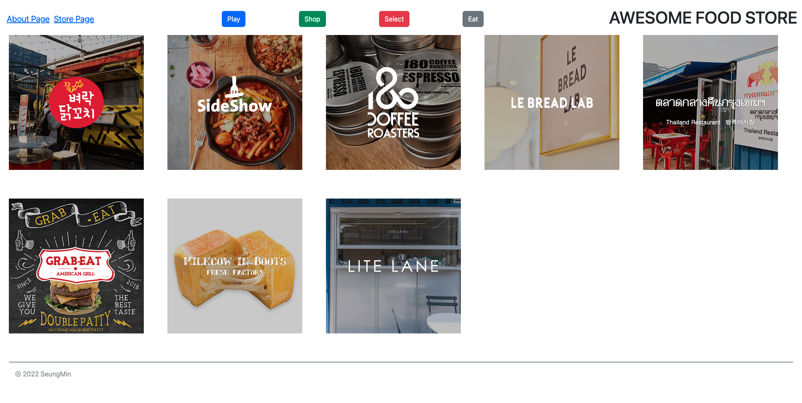

# 맛집리스트와 상세 설명을 나타내는 웹사이트 (by Next.JS)

프로젝트 진행 과정 및 설명.

1. json-server를 이용한 데이터 fetching 완료.

2. React-Bootstrap 적용.

3. Header에서는 프로젝트 이름(AWESOME FOOD STORE) 및 About 페이지와 Store 페이지로 이동할 수 있는 NavBar 기능 구현.

4. STORE 리스트를 정렬된 정사각형 이미지 형태로 나타내기 위해서 CSS-Grid를 이용.

5. About 페이지에서 간단한 프로젝트 소개 문구 확인 가능.

6. Store 페이지 링크 클릭시 Home으로 돌아옵니다.

7. Footer에 copyright 추가 완료.

8. 하나의 아이템을 선택하면 팝업(모달)을 띄워주는데 여기서 맛집에 관한 정보들을 확인이 가능합니다. (by props-drilling)

9. 팝업(모달) 오른쪽 위에 X 버튼을 클릭하면 팝업이 닫힙니다.

10. 정의되지 않은 잘못된 url로 접근할 시 에러 메시지를 보여주고 5초 후에 메인 페이지로 이동하게 구현했습니다. (useRouter, setTimeout 이용)

# 테스트 결과 로컬에서 실행 방법

1. zip 파일 다운로드 후 압축해제 혹은 clone
2. yarn install 실행
3. json-server -p 9000 db.json 실행
4. yarn dev 실행

# 프로젝트 실행 화면

